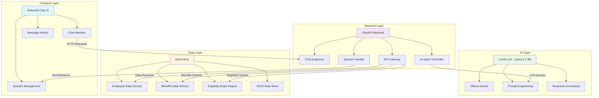
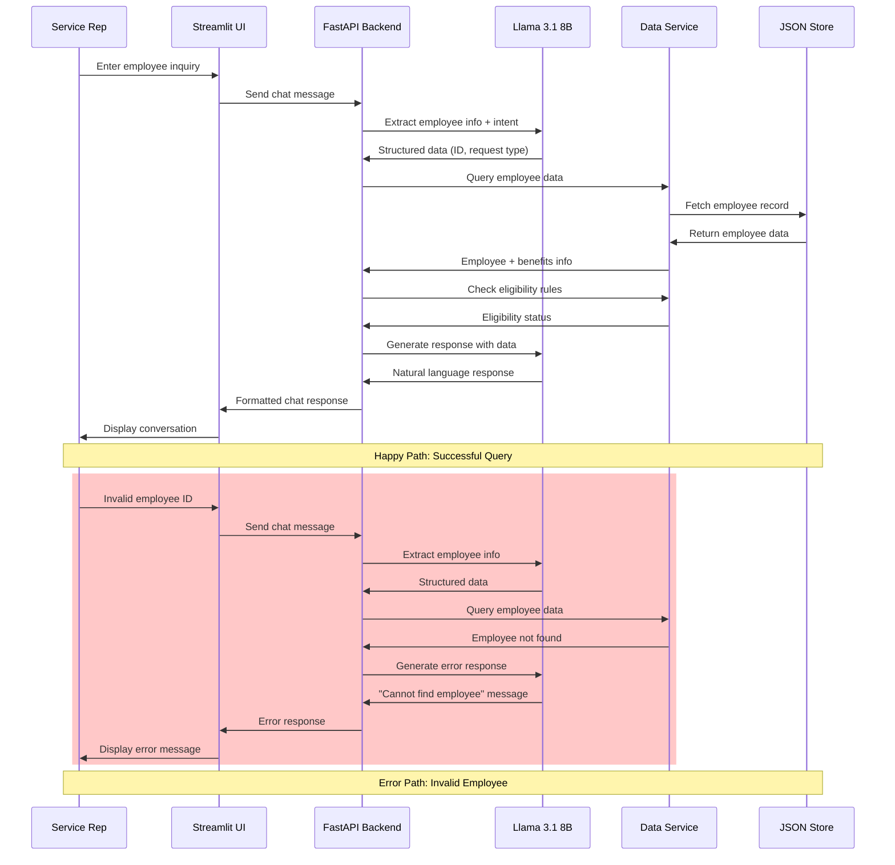
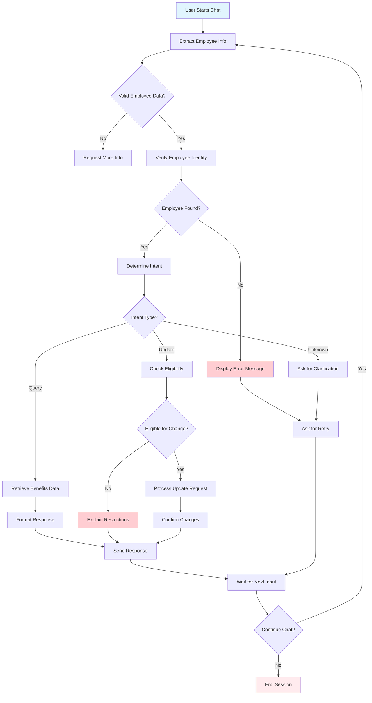
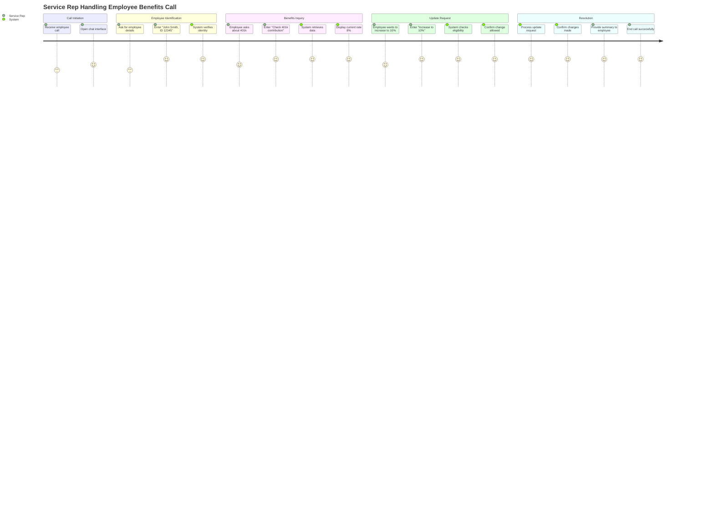
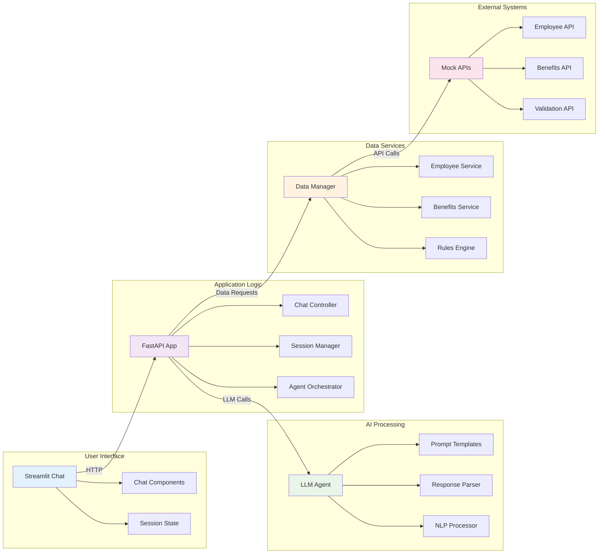

# AI Service Center POC - Technical 1-Pager

## Executive Summary
Transform traditional UI-driven HR Benefits service center into a conversational AI agent that handles employee benefit inquiries through natural language chat, maintaining same capabilities with improved user experience and efficiency.

## Business Value
- **Reduced Training Time**: Natural language interface eliminates need for complex UI training
- **Improved Accuracy**: AI agent ensures consistent responses and reduces human error
- **Enhanced Compliance**: Built-in safeguards for HIPAA/PI data handling
- **Scalable Solution**: Foundation for expanding to other service center functions

## Technical Architecture

### System Architecture


### Technology Stack
- **Frontend**: Streamlit (Python-based chat interface)
- **Backend**: FastAPI (REST API layer)
- **LLM**: Llama 3.1 8B via Ollama (local deployment)
- **Data**: JSON files for mocked employee/benefits data
- **Session Management**: In-memory storage for chat history

## Implementation Approach

### Phase 1: Core MVP (Days 1-3)
1. **Environment Setup**
   - Install Ollama and Llama 3.1 8B model
   - Create FastAPI backend with basic endpoints
   - Build Streamlit chat interface

2. **Mock Data Creation**
   - Employee profiles with personal info
   - 401k and Medical plan data
   - Eligibility rules implementation

3. **AI Agent Development**
   - Natural language processing for employee identification
   - Benefits query handling
   - Update request processing

### Phase 2: Demo Scenarios (Days 4-5)
1. **Happy Path Scenarios**
   - 401k contribution rate inquiry and increase
   - Medical plan details and dependent addition

2. **Error Handling**
   - Invalid employee information
   - Eligibility restrictions
   - API failure graceful handling

## Demo Scenarios

### Scenario 1: 401k Inquiry (Happy Path)
**User**: "Hi, I'm John Smith, employee ID 12345. I want to check my 401k contribution rate and maybe increase it."
**Expected Flow**: Verify identity → Retrieve 401k info → Present current rate → Process increase request

### Scenario 2: Medical Plan Update (Happy Path)
**User**: "I need to add my newborn to my medical plan. My name is Sarah Johnson, DOB 01/15/1985."
**Expected Flow**: Verify identity → Check medical plan → Validate dependent eligibility → Process addition

### Scenario 3: Eligibility Error
**User**: "I'm a part-time employee, why can't I enroll in medical?"
**Expected Flow**: Verify identity → Check eligibility → Explain requirements (1000 hrs or 1 year rule)

### Data Flow Diagram


### Functional Workflow Diagram


### User Journey Flow Diagram


### System Component Interaction Diagram


### Data Structure
```json
{
  "employee": {
    "id": "12345",
    "name": "John Smith",
    "dob": "1990-05-15",
    "ssn": "xxx-xx-1234",
    "employment_status": "full_time",
    "hire_date": "2020-03-01"
  },
  "benefits": {
    "401k": {
      "contribution_rate": 8,
      "employer_match": 4,
      "balance": 45000,
      "eligible_for_match": true
    },
    "medical": {
      "plan": "PPO Gold",
      "coverage": "employee_only",
      "eligible": true
    }
  }
}
```

### Eligibility Rules
- **Medical**: Full-time employees immediately eligible; Part-time after 1000 hours or 1 year
- **401k Match**: All employees must wait 1 year before employer match contribution

## Setup Instructions

### Local LLM Setup (Ollama)
```bash
# Install Ollama (macOS)
curl -fsSL https://ollama.com/install.sh | sh

# Pull Llama 3.1 8B model
ollama pull llama3.1:8b

# Verify installation
ollama run llama3.1:8b
```

### Application Setup
```bash
# Clone repository
git clone [repo-url]
cd ai-service-center-poc

# Create virtual environment
python -m venv venv
source venv/bin/activate

# Install dependencies
pip install -r requirements.txt

# Start FastAPI backend
uvicorn main:app --reload --port 8000

# Start Streamlit frontend
streamlit run chat_app.py
```

## Risk Mitigation

### Technical Risks
- **LLM Accuracy**: Implement strict validation and "I don't know" responses
- **API Failures**: Graceful error handling with user-friendly messages
- **Data Security**: Mock data only, no real PI/HIPAA data in POC

### Demo Risks
- **Backup Plan**: Keep mocked APIs as fallback if real API integration fails
- **Performance**: Local LLM ensures no network dependencies during demo
- **Environment**: Self-contained MacBook Pro setup eliminates external dependencies

## Success Metrics
- **Accuracy**: 95%+ correct responses for demo scenarios
- **User Experience**: Natural conversation flow with <3 second response times
- **Error Handling**: Graceful failure modes with appropriate messaging
- **Stakeholder Confidence**: Clear demonstration of concept viability

## Future Roadmap
1. **Phase 3**: Integration with actual REST APIs
2. **Phase 4**: Voice interface capability
3. **Phase 5**: Additional benefit types (dental, vision, disability)
4. **Phase 6**: Multi-language support
5. **Phase 7**: Advanced analytics and reporting

## Deliverables
- Working Streamlit chat application
- FastAPI backend with mocked APIs
- Comprehensive setup documentation
- Demo script with test scenarios
- Technical documentation and architecture diagrams

---
**Timeline**: 3-5 days | **Team**: 1-2 developers | **Environment**: MacBook Pro (local)