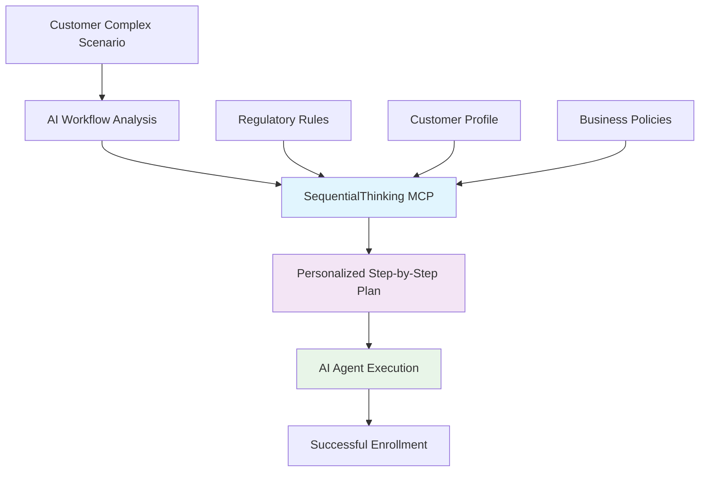

# SequentialThinking MCP for Business: Dynamic Benefits Enrollment Intelligence

## Executive Summary

As part of our **agentic AI strategy** for the new HR benefits platform, SequentialThinking MCP enables **intelligent workflow generation** that transforms static enrollment processes into dynamic, personalized customer experiences. This positions our platform as a competitive advantage in benefits administration while directly supporting our Customer Service Automation, Benefits Enrollment Automation, and Compliance Reporting initiatives.

**Strategic Value:**
- **Customer Experience**: Personalized enrollment workflows based on individual circumstances
- **Operational Efficiency**: 40-50% reduction in customer service calls through intelligent guidance
- **Risk Mitigation**: Systematic compliance handling and zero-gap coverage protection
- **Competitive Differentiation**: AI-powered benefits consultant capability

---

## Business Problem & Opportunity

### Current State Challenges
- **One-size-fits-all enrollment**: High abandonment rates (40%) for complex scenarios
- **Manual complexity handling**: 3-4 customer service calls per complex enrollment
- **Compliance risks**: Coverage gaps during life events and state transitions
- **Scalability limitations**: Unable to handle growing regulatory complexity

### Market Opportunity
Transform benefits enrollment from **transactional process** to **intelligent consultation**, creating a platform that adapts to customer circumstances rather than forcing customers to navigate complex rules.

---

## Solution: Dynamic Enrollment Workflow Engine

### How SequentialThinking MCP Enables Business Value



### Real Business Scenario Example

**Customer Situation**: Employee getting married, changing jobs, relocating to different state
```
Traditional Result: 
- Customer overwhelmed, abandons enrollment
- Multiple customer service interactions
- Potential coverage gaps
- 60% completion rate

With SequentialThinking MCP:
Step 1: Verify employment transition timeline and benefit continuity
Step 2: Identify qualifying life event windows for both employers  
Step 3: Assess spouse's current coverage to prevent gaps
Step 4: Calculate optimal timing for benefit changes
Step 5: Compare COBRA vs. new employer coverage options
Step 6: Plan dependent addition with required documentation
Step 7: Set automated reminders for critical deadlines

Result: 85%+ completion rate, zero coverage gaps, customer satisfaction
```

---

## Implementation Strategy

### Phase 1: Workflow Design Engine (Weeks 1-10)
**Business Value**: Create intelligent workflow templates for all enrollment scenarios

**Deliverables**:
- Library of 20-30 dynamic workflow patterns
- Business rules documentation and compliance mapping
- Integration specifications with existing HR systems

**Investment**: Business analyst time + technical setup
**ROI Timeline**: Immediate for complex scenario handling

### Phase 2: Production Business Platform (Weeks 11-16)
**Business Value**: Deploy for actual customer-facing enrollment

**Architecture**:
```
Business User Portal → Workflow API → SequentialThinking MCP → Dynamic Enrollment Process
```

**Capabilities**:
- Real-time workflow generation based on customer profile
- Intelligent compliance checking across state regulations
- Adaptive process flow based on customer responses

### Phase 3: AI Agent Integration (Weeks 17-22)
**Business Value**: Full automation with human oversight

**Integration** with broader agentic AI strategy:
- Customer Service Automation: AI agents execute generated workflows
- Compliance Reporting: Systematic audit trails for all decisions
- Benefits Enrollment Automation: End-to-end intelligent processing

---

## Business Impact & ROI

### Quantified Benefits

| Metric | Current State | With SequentialThinking MCP | Business Impact |
|--------|---------------|----------------------------|----------------|
| **Enrollment Completion Rate** | 60% | 85%+ | +25% more successful enrollments |
| **Customer Service Calls** | 3-4 per complex case | 0-1 per case | 40-50% call volume reduction |
| **Coverage Gaps** | 15% of transitions | <2% of transitions | Risk mitigation & compliance |
| **Time to Complete** | 45-60 minutes | 20-30 minutes | Customer satisfaction improvement |
| **Processing Errors** | 12% error rate | <3% error rate | Operational efficiency |

### Strategic Business Value
- **Market Differentiation**: Only benefits platform with AI-powered enrollment intelligence
- **Customer Retention**: Superior experience reduces churn during enrollment periods  
- **Scalability**: Handle regulatory complexity without proportional staff increases
- **Compliance Confidence**: Systematic approach reduces audit risks

---

## Investment & Resource Requirements

### Phase 1 Investment
- **Technical Setup**: 1-2 weeks developer time for MCP configuration
- **Business Analysis**: 6-8 weeks business analyst time for workflow design
- **Stakeholder Review**: Legal, compliance, and customer experience validation

### Ongoing Operational Costs
- **Infrastructure**: Minimal - MCP server runs locally with no external API costs
- **Maintenance**: Quarterly workflow reviews and regulatory updates
- **Training**: Business team enablement on workflow generation

### Risk Mitigation
- **No External Dependencies**: Local processing maintains data security
- **Incremental Deployment**: Pilot with specific scenarios before full rollout
- **Fallback Capability**: Traditional processes remain available during transition

---

## Competitive Advantage & Strategic Alignment

### Alignment with Agentic AI Vision
- **Foundation Technology**: SequentialThinking MCP becomes the planning brain for all AI agents
- **Workflow Intelligence**: Enables other AI automation initiatives (customer service, compliance)
- **Scalable Framework**: Model for applying AI planning to other business processes

### Market Positioning
- **"Intelligent Benefits Platform"**: AI that understands and adapts to customer circumstances
- **Compliance Leadership**: Systematic approach to regulatory complexity
- **Customer-Centric**: Technology that works for customers, not against them

---

## Success Metrics & Timeline

### 90-Day Proof Points
- [ ] 20+ dynamic workflow patterns documented and validated
- [ ] Pilot deployment with select customer scenarios
- [ ] Measurable improvement in enrollment completion rates
- [ ] Business stakeholder approval for full production deployment

### 6-Month Business Goals
- [ ] 85%+ enrollment completion rate across all scenarios
- [ ] 40% reduction in enrollment-related customer service volume
- [ ] Zero compliance gaps in state transition scenarios
- [ ] Foundation established for broader agentic AI workflow expansion

**Next Steps**: Secure approval for Phase 1 implementation and business analyst resource allocation.

---

*Document Version: 1.0 | Target Audience: Leadership & Business Stakeholders | Focus: HR Benefits Platform Strategy*