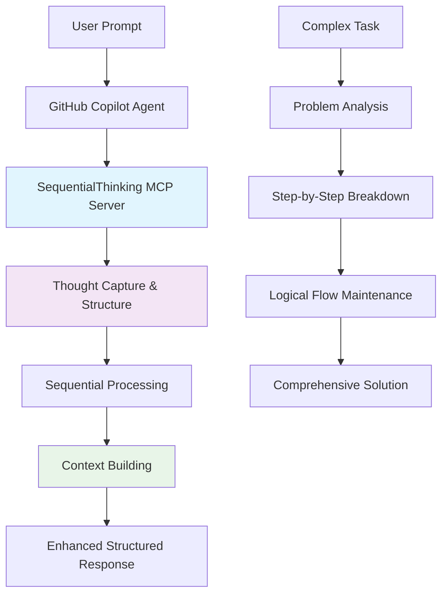
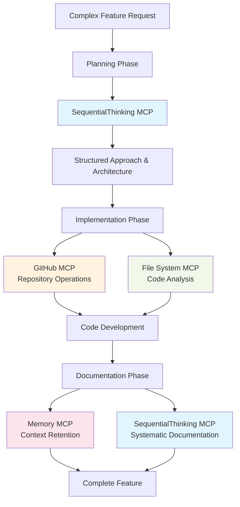

# SequentialThinking MCP Server - Technical One-Pager

## Executive Summary

The SequentialThinking MCP server enhances GitHub Copilot's agent mode by providing a structured thinking framework that breaks down complex problems into manageable, sequential steps. This **official, local-only server** requires no external API keys and processes all data within your VS Code environment, making it enterprise-safe for sensitive HR benefits platform development.

**Key Benefits:**
- **Enhanced Problem Solving**: Systematic approach to complex development tasks
- **Zero External Dependencies**: No API keys or external data transmission
- **Enterprise Security**: All processing happens locally within VS Code
- **Improved Code Quality**: Structured thinking leads to better architectural decisions
- **Team Consistency**: Standardized approach to problem decomposition

---

## How SequentialThinking MCP Server Works

### High-Level Architecture

The server operates as a **local thinking framework** that intercepts and structures Copilot's reasoning process:

1. **Thought Capture**: Records individual thinking steps during problem-solving
2. **Sequential Processing**: Maintains logical flow between thoughts
3. **Context Persistence**: Preserves reasoning history throughout the session
4. **Structured Output**: Organizes thoughts into coherent, reviewable sequences

### Technical Flow



The server acts as a **cognitive middleware** between your prompts and Copilot's responses, ensuring systematic problem breakdown without external data exposure.

---

## Configuration Setup in VS Code

### Global Setup (Recommended for Team Consistency)

1. **Enable MCP Support**: Press `Ctrl+Shift+P` → "Preferences: Open Settings (JSON)" and add:
```json
{
  "chat.mcp.enabled": true,
  "chat.mcp.servers": {
    "sequential-thinking": {
      "command": "npx",
      "args": ["-y", "@modelcontextprotocol/server-sequential-thinking"]
    }
  }
}
```

### Alternative: Workspace-Specific Setup

2. **Local Workspace Configuration**: Create `.vscode/mcp.json` in your workspace root:
```json
{
  "mcpServers": {
    "sequential-thinking": {
      "command": "npx",
      "args": ["-y", "@modelcontextprotocol/server-sequential-thinking"]
    }
  }
}
```

**Activation**: Restart VS Code → Open Copilot Chat → Select "Agent" mode → Tools icon → Verify "sequential-thinking" is listed

---

## Practical Implementation Examples

### Example 1: Data Migration Module Development

**Scenario**: Migrating legacy HR data to new Cosmos DB structure

**Traditional Approach**:
```
Developer: "Help me design data migration from legacy SQL to Cosmos DB for employee benefits"
```

**With SequentialThinking**:
```
Developer: "Use sequential thinking to design comprehensive data migration strategy from legacy SQL to Cosmos DB for employee benefits module"

Structured Output:
Step 1: Analyze legacy schema and identify key entities (employees, benefits, enrollments)
Step 2: Design Cosmos DB partition strategy based on employee ID and benefit year
Step 3: Plan data transformation logic for schema differences
Step 4: Design incremental migration approach with rollback capability
Step 5: Create validation framework to ensure data integrity
Step 6: Plan testing strategy with production data samples
```

**Result**: More comprehensive, reviewable migration strategy with clear implementation phases.

### Example 2: CDC Implementation for Data Lake

**Scenario**: Setting up Change Data Capture from Cosmos DB to Hudi format

**With SequentialThinking**:
```
Developer: "Use sequential thinking to implement CDC pipeline from Cosmos DB to Apache Hudi for our HR benefits data lake"

Structured Output:
Step 1: Evaluate Cosmos DB change feed configuration for benefits data
Step 2: Design event-driven architecture using Azure Functions or Event Hubs
Step 3: Implement data transformation layer for Hudi format compatibility
Step 4: Configure Hudi table structure with proper partitioning (department, year)
Step 5: Design error handling and retry mechanisms for failed CDC events
Step 6: Implement monitoring and alerting for pipeline health
Step 7: Plan testing with schema evolution scenarios
```

**Business Impact**: Systematic approach ensures robust, maintainable CDC pipeline with proper error handling and monitoring.

---

## Security & Compliance

### Enterprise-Safe Architecture

✅ **Local Processing Only**: All thinking operations happen within VS Code environment  
✅ **No External APIs**: Zero dependency on third-party services  
✅ **No API Keys Required**: No credentials to manage or secure  
✅ **Data Residency**: HR benefits data never leaves your local environment  
✅ **Audit Trail**: All thinking steps are logged locally for compliance review  

### Compliance Benefits
- **SOC 2 Compatible**: No external data transmission
- **GDPR/CCPA Friendly**: Employee data stays within controlled environment
- **Zero Trust Ready**: No external network dependencies
- **Internal Audit Safe**: Complete thinking process is reviewable and traceable

---

## Cost & Resource Impact

### Token Usage Analysis

**Without SequentialThinking**:
- Single response: ~1,000-2,000 tokens per complex query
- Multiple iterations: 3-5 separate queries needed

**With SequentialThinking**:
- Enhanced single response: ~2,000-3,500 tokens per complex query
- Reduced iterations: 1-2 queries typically sufficient

### Premium Model Impact

**Sonnet 4 & Gemini 2.5 Pro Usage**:
- **Token Increase**: 40-60% higher per individual query
- **Query Reduction**: 50-70% fewer total queries needed
- **Net Efficiency**: 20-30% better token efficiency overall
- **Quality Improvement**: Significantly better first-attempt solutions

### Cost-Benefit Analysis
| Metric | Traditional Approach | With SequentialThinking |
|--------|---------------------|------------------------|
| Queries per Complex Task | 4-6 | 1-2 |
| Tokens per Query | 1,500 avg | 2,500 avg |
| Total Tokens per Task | 6,000-9,000 | 2,500-5,000 |
| **Net Token Savings** | - | **30-40%** |

---

## Integration with Development Workflow

## Integration with Development Workflow

### Synergy with Other MCP Servers

**Recommended MCP Stack for HR Benefits Platform**:

1. **SequentialThinking**: Problem decomposition and planning
2. **GitHub MCP**: Repository management and PR creation
3. **File System MCP**: Code analysis and file operations
4. **Memory MCP**: Session context persistence

### Development Workflow Integration



### Best Practices

**For Complex Features**:
- Start with SequentialThinking for architectural planning
- Use specific thinking prompts: "Think through the implications of..."
- Review thinking steps before implementation
- Combine with other MCP servers for execution

**For Code Reviews**:
- Use SequentialThinking to analyze code systematically
- Document reasoning for architectural decisions
- Create reviewable thinking trails for team knowledge sharing

---

## Getting Started Checklist

- [ ] Enable MCP support in VS Code settings
- [ ] Add SequentialThinking server to `.vscode/mcp.json`
- [ ] Restart VS Code and verify server connection
- [ ] Test with simple thinking prompt in Agent mode
- [ ] Try complex problem decomposition for current HR platform feature
- [ ] Share approach with team for consistency

**Next Steps**: Consider integrating with GitHub MCP and Memory MCP for complete development workflow enhancement.

---

*Document Version: 1.0 | Last Updated: July 2025 | Target: HR Benefits Platform Development Team*
